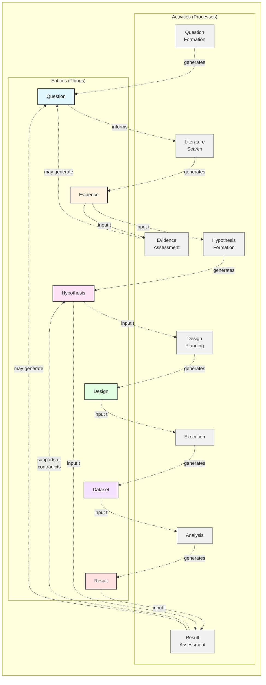

# Scimantic Vision: Semantic Research from Day One

## Introduction: The Scientific Method as a Provenance Chain

Science advances through a systematic reasoning process - the **scientific method** - that transforms questions into validated knowledge. This process can be represented as a **provenance chain** where each step builds on the previous, with feedback loops enabling iterative refinement.

### The Reasoning Chain: Entities, Activities, and Feedback

The scientific method involves both **things** (questions, evidence, hypotheses, data, results) and **processes** (searching, assessing, designing, executing, analyzing). Following the W3C PROV-O ontology structure, we can map the scientific method to:

- **Entities** (`prov:Entity`): Concrete artifacts of research
- **Activities** (`prov:Activity`): Processes that create or transform entities
- **Agents** (`prov:Agent`): Researchers, AI assistants, and software

**The Flow (with feedback loops):**

1. **Question Formation** (activity) → **Question** (entity): Research begins with a question
   - *Example*: "Can the MQDO method accurately compute differential cross sections for p + ¹²C scattering?"

2. **Literature Search** (activity) → **Evidence** (entity): Extract facts from papers
   - *Example*: "Smith 2023 reports DCS = 150 mb at E = 10 MeV"
   - *Provenance*: Who extracted? From which source? With what uncertainty?

3. **Evidence Assessment** (activity): Evaluate credibility and relevance
   - *Example*: High credibility (peer-reviewed, experimental measurement)
   - *Feedback*: May generate new questions ("What other methods exist?")

4. **Hypothesis Formation** (activity) → **Hypothesis** (entity): Synthesize evidence into testable claims
   - *Example*: "MQDO should predict DCS within 10% error"
   - *Provenance*: Which evidence supports this? What's the uncertainty?

5. **Design Planning** (activity) → **Design** (entity): Specify experimental/computational method
   - *Example*: "Run MQDO code with E = 10 MeV, angular range 0-180°"
   - *Provenance*: Motivated by which hypothesis?

6. **Execution** (activity) → **Dataset** (entity): Run experiments/simulations
   - *Example*: MQDO computation produces numerical output
   - *Provenance*: Which code version? What input parameters? Computational environment?

7. **Analysis** (activity) → **Result** (entity): Process data into findings
   - *Example*: "Computed DCS = 148 mb ± 5 mb"
   - *Provenance*: Which analysis script? How was uncertainty calculated?

8. **Result Assessment** (activity): Compare result to hypothesis
   - *Example*: Result supports hypothesis (148 mb vs 150 mb, within error)
   - *Feedback*: May generate new questions ("Why 2 mb difference?")

### The Critical Problem: This Chain is Invisible to Machines

**Today's reality**: This reasoning chain exists only in researchers' heads and narrative text.

- **Lab notebooks**: "We hypothesized X because papers Y and Z suggest..." (unstructured prose)
- **Papers**: Methods sections describe *what* was done, not *why* (hypothesis → design linkage is implicit)
- **Workflow systems**: Track code execution (Nextflow knows which script ran), but not reasoning motivation (Nextflow doesn't know *why* you chose that analysis)
- **AI tools**: Extract facts from papers but output text summaries, not machine-readable provenance

**The consequence**:
- "How did we arrive at this conclusion?" is answerable for humans reading lab notes, but not for machines querying a knowledge graph
- Reproducibility is **computational** (can re-run code) but not **scientific** (can't trace reasoning from evidence to hypothesis to result)
- AI agents start every conversation from scratch—no persistent memory of the research process

### The Scimantic Solution: Machine-Readable Provenance from Day One

**Scimantic makes the entire reasoning chain machine-readable** using W3C standards:

- **W3C PROV-O**: Standard ontology for provenance (entities, activities, agents, relationships)
- **URREF**: Uncertainty representation (epistemic vs aleatory, ambiguity vs incompleteness)
- **Nanopublications**: Atomic publishable units with assertion + provenance + metadata
- **PROV-K**: Discourse extensions (supports, contradicts, refines relationships)

**Every stage becomes RDF**:
- Question → `scimantic:Question` entity with `rdfs:label`
- Literature search → `scimantic:LiteratureSearch` activity with `prov:used` (source DOI), `prov:wasAssociatedWith` (researcher/AI)
- Evidence → `scimantic:Evidence` entity with `prov:wasGeneratedBy` (search activity), `prov:wasQuotedFrom` (source), `scimantic:hasUncertainty` (URREF entity)
- Hypothesis → `scimantic:Hypothesis` entity with `prov:wasDerivedFrom` (evidence), uncertainty propagation
- ... (continues through all stages)

**The result**: A unified knowledge graph where SPARQL queries can answer:
- "What evidence supports hypothesis X?" → Traverse `prov:wasDerivedFrom` chains
- "Which experiments tested this hypothesis?" → Find designs with `prov:wasDerivedFrom` hypothesis
- "How was this result computed?" → Trace `prov:wasGeneratedBy` → analysis activity → code version
- "What's the uncertainty propagation path?" → Follow URREF `derivedFrom` chains from evidence → hypothesis → result

### Why This Matters

**For researchers**:
- Lab notebook is a **queryable knowledge graph**, not scattered notes
- Literature review creates **persistent semantic annotations** (evidence nanopublications), not ephemeral highlights
- Hypothesis reasoning is **traceable and verifiable**, not lost after the paper is written

**For AI agents**:
- **Persistent memory**: All research artifacts stored as RDF, survives beyond single conversations
- **Collaborative research**: AI can propose hypotheses by querying evidence patterns, human validates
- **Smart assistants**: "What contradicts my hypothesis?" → AI queries PROV-K `contradicts` relations

**For science**:
- **Reproducibility by design**: Complete provenance from question → result, not just final methods
- **Living knowledge graphs**: Research builds on federated semantic graphs, not isolated PDFs
- **Transparent reasoning**: Hypothesis formation is computable, not narrative handwaving

The rest of this document shows how existing tools address *parts* of this vision (literature extraction, workflow provenance, semantic publishing) and where **Scimantic fills the gaps** by integrating all stages into a unified, standards-based semantic framework.

---

## The State of the Art: Tools for Individual Stages

The scientific community has built impressive tools for **individual stages** of the reasoning chain. However, these tools operate in isolation, without machine-readable connections between stages.

### Mapping Existing Tools to the Reasoning Chain

#### Stage 1-2: Question Formation & Literature Search

**What exists:**
- **Semantic Scholar**: 225M+ papers with structured metadata, natural language summaries, API access
- **AI extraction tools**: Elicit (99.4% extraction accuracy), Scite (citation context), Consensus (evidence summaries)
- **Citation graphs**: ResearchRabbit, Connected Papers, Litmaps for visual discovery
- **Reference managers**: Zotero with PDF annotation extraction, MCP integration for AI search

**What's missing:**
- Tools output **text**, not RDF entities
- No provenance linking Question → LiteratureSearch activity → Evidence entity
- AI extractions lost after conversation ends (no persistent graph)

#### Stage 3: Evidence Assessment & Hypothesis Formation

**What exists:**
- **Electronic Lab Notebooks**: 35% institutional adoption, 58% with AI features for structured data entry
- **Discourse ontologies**: AIDA principles (Atomic, Independent, Declarative, Absolute), argumentation models
- **PROV-K**: Support/conflict relations for evidence linkage with certainty degrees

**What's missing:**
- Evidence assessment is **narrative** ("this paper is credible because..."), not computable
- Hypothesis formation is **undocumented** - no provenance linking Evidence → Hypothesis
- Can't query "which evidence supports hypothesis X?" (relationship is implicit in text)

#### Stage 4-5: Design Planning & Execution

**What exists:**
- **Workflow systems**: Nextflow (dominant, 24% of WorkflowHub), Snakemake, Galaxy, CWL track execution
- **W3C PROV-O**: yProv ecosystem, Python prov package capture computational provenance
- **Containerization**: Docker ensures reproducible execution environments
- **Code Ocean**: Integrated into Nature peer review for computational reproducibility

**What's missing:**
- Design → Hypothesis linkage is **absent** (workflows don't know *why* they exist)
- Execution provenance is **computational** only (which script ran), not **scientific** (which hypothesis motivated it)
- Can't query "which experiments tested this hypothesis?"

#### Stage 6-7: Analysis & Result Assessment

**What exists:**
- **Jupyter provenance**: ProvBook, MLProvLab extensions (though only 8.5% fully reproducible)
- **Research compendia**: Quarto (next-gen R Markdown), targets package for literate programming
- **FAIR principles**: 35% institutional adoption, NIH Strategic Plan 2025-2030 priority

**What's missing:**
- Result → Hypothesis comparison is **implicit** (discussed in text, not RDF)
- No `prov:supports` or `prov:contradicts` relations linking Result to Hypothesis
- Assessment activities don't generate new Questions (feedback loop is manual)

### Cross-Cutting Infrastructure (All Stages)

**What exists:**
- **RDF/Linked Data**: Life sciences maturity (UniProt, ChEBI, Gene Ontology, Reactome, Ensembl with SPARQL endpoints)
- **Nanopublications**: Nanopub.net servers with Trusty URIs for verifiable, immutable assertions
  - Active in biomedical ontologies, biodiversity data, FAIR Supporting Resources
  - Growing adoption: ESWC 2025 tutorial, Knowledge Pixels managed services
- **W3C Standards**: PROV-O, FOAF (agents), DC Terms (metadata), SKOS (taxonomies), OWL (reasoning)
- **URREF**: Uncertainty Representation and Reasoning Evaluation Framework ontology
  - Uncertainty types: Ambiguity, randomness, vagueness, inconsistency, incompleteness
  - Uncertainty nature: Aleatory (inherent) vs. epistemic (knowledge gaps)
  - Information fusion methods: Dempster-Shafer, belief entropy, credibility weighting
- **Model Context Protocol (MCP)**: Emerging standard (1-year anniversary Nov 2025)
  - Berkeley Lab pilots for cross-division data access
  - Healthcare/life sciences processing hundreds of thousands of data points

**What's missing:**
- Infrastructure exists, but **no tool uses it end-to-end** for the full reasoning chain
- RDF is siloed in final publications (nanopubs), not used **from day one** of research
- URREF defines uncertainty, but researchers store it as **narrative text**, not RDF entities
- MCP integrations produce text summaries, not persistent RDF graphs

### Summary: Strong Foundations, Missing Integration

**What's working:**
- Robust tools for **individual stages** (Semantic Scholar for literature, Nextflow for execution, Jupyter for analysis)
- Solid **semantic web standards** (PROV-O, URREF, Nanopublications, FOAF, DC Terms, PROV-K)
- Growing **AI integration** via MCP for tool access
- Domain-specific RDF in life sciences (UniProt, GO, ChEBI with SPARQL endpoints)

**What's broken:**
- **No end-to-end integration**: Tools operate in isolation, no machine-readable connections between stages
- **Entity chains invisible**: Question → Evidence → Hypothesis → Design → Dataset → Result links exist only in researchers' heads, not as `prov:wasDerivedFrom` chains
- **Activities undocumented**: LiteratureSearch, Assessment, HypothesisFormation happen but aren't captured as PROV-O activities
- **Feedback loops missing**: Assessment doesn't generate new Questions; contradictory evidence doesn't create `prov:contradicts` relations
- **Uncertainty as text**: URREF defines structure, but researchers write "high confidence" instead of creating `urref:UncertaintyEntity` RDF
- **Semantic publishing post-hoc**: Nanopubs created after research is done, not minted automatically during each stage
- **No persistent AI memory**: AI extractions produce text summaries, not RDF entities in shared knowledge graphs
- **Domain gap**: Strong in life sciences (biology, medicine), weak in physical sciences (physics, chemistry, engineering)

---

## The Scimantic Solution

Scimantic **builds on existing tools** (Semantic Scholar, Elicit, Nextflow, PROV-O, nanopub.net) to create a unified semantic workflow where **research reasoning** is machine-readable from inception.

### How Scimantic Builds on Standards and Open Ecosystems

**Scimantic is built on W3C and community standards**, not proprietary tools or schemas:

**Ontology Foundation**:
- **W3C PROV-O**: Complete provenance vocabulary (`prov:Entity`, `prov:Activity`, `prov:Agent`, `prov:wasDerivedFrom`, `prov:wasGeneratedBy`)
- **URREF**: Draft international standard for uncertainty representation (`urref:AleatoricUncertainty`, `urref:EpistemicUncertainty`, uncertainty types)
- **Nanopublication schema**: Trusty URIs, assertion/provenance/pubinfo structure
- **FOAF**: Agent representation (`foaf:Person`, `foaf:Organization`)
- **DC Terms**: Metadata (`dcterms:created`, `dcterms:creator`, `dcterms:source`)
- **PROV-K**: Discourse ontology patterns for scientific argumentation (`prov:supports`, `prov:contradicts`)
- **AIDA principles**: Atomic, Independent, Declarative, Absolute nanopublication guidelines

**Development Environment**:
- **VS Code extension**: Knowledge graph visualization, nanopub editing, provenance navigation
- **MCP integration**: AI agents (e.g., Claude Code, compatible LLMs) access knowledge graph via Model Context Protocol (MCP)
- **RDFLib**: Python library for RDF manipulation, SPARQL queries, Turtle serialization
- **Existing workflow systems**: Nextflow, Snakemake, Jupyter (decorated with PROV-O tracking, not replaced)

**What Scimantic Adds** (Integration Layer, Not New Standards):

**Entities** (Research artifacts as `prov:Entity` subclasses):
- `scimantic:Question`: Research questions that motivate investigations
- `scimantic:Evidence`: Facts extracted from literature with provenance and uncertainty
- `scimantic:Hypothesis`: Claims derived from evidence synthesis
- `scimantic:Design`: Experimental/computational method specifications (also `prov:Plan`)
- `scimantic:Dataset`: Observational data or experimental measurements
- `scimantic:Result`: Analysis outcomes with uncertainty propagation

**Activities** (Research processes as `prov:Activity` subclasses):
- `scimantic:QuestionFormation`: Formulating research questions
- `scimantic:LiteratureSearch`: Searching and extracting from papers
- `scimantic:Assessment`: Evaluating credibility, validity, or generating support/contradict relations
- `scimantic:HypothesisFormation`: Synthesizing evidence into hypotheses
- `scimantic:DesignPlanning`: Creating experimental/computational designs
- `scimantic:Execution`: Running experiments or simulations
- `scimantic:Analysis`: Processing datasets into results

**Integration Features**:
- **Automatic nanopub generation**: Every research action mints nanopubs using standard schema
- **Complete provenance chains**: Links all entities via `prov:wasDerivedFrom`, all activities via `prov:wasInformedBy`
- **Feedback loops**: Assessment activities generate new Questions; Results can refine Hypotheses
- **URREF uncertainty propagation**: Automatic calculation using `urref:derivedFrom` chains
- **Access-level publishing**: Same RDF model, different visibility scopes (local/institutional/public)
- **MCP tools for AI**: `add_evidence`, `create_hypothesis`, `query_graph`, `assess_result` enable AI collaboration
- **PROV-K discourse relations**: `prov:supports`, `prov:contradicts` link Results to Hypotheses

### How It Works: Semantic-First Research

Scimantic integrates into the researcher's workflow at every stage of the reasoning chain, automatically capturing entities and activities as RDF:

**1. Semantic from Day One**
- **Literature extraction** creates `scimantic:Evidence` entities (not text notes)
- **Hypothesis formation** creates `scimantic:Hypothesis` entities with `prov:wasDerivedFrom` links to evidence
- **Design planning** creates `scimantic:Design` entities with `prov:wasDerivedFrom` links to hypotheses
- All stored in local `project.ttl` graph—immediately queryable via SPARQL

**2. Complete Provenance Chains**
- Every entity traces back through the reasoning chain: Result → Analysis activity → Dataset → Execution activity → Design → Hypothesis → Evidence → Literature Search activity
- Activities document *why* (which hypothesis motivated this experiment?) not just *what* (which script ran?)
- SPARQL queries answer: "How did we get this result?" by traversing `prov:wasGeneratedBy` and `prov:wasDerivedFrom` chains

**3. Automatic Nanopublication Generation**
- Each research action (extract evidence, form hypothesis, run analysis) mints a nanopublication automatically
- No manual RDF authoring—Scimantic wraps actions in standard schema (assertion + provenance + pubinfo)
- Nanopubs generated during research, not post-hoc after publication

**4. AI Persistent Memory via MCP**
- AI agents (via MCP) read/write RDF entities to shared `project.ttl` graph
- Evidence extracted by AI becomes permanent nanopub, survives beyond conversation
- AI can query: "What contradicts hypothesis X?" by traversing PROV-K `prov:contradicts` relations
- Collaborative research: AI suggests hypotheses from evidence patterns, human validates

**5. URREF Uncertainty Propagation**
- Evidence has `urref:UncertaintyEntity` (epistemic, aleatory, with quantification)
- Hypothesis uncertainty auto-calculated from evidence uncertainties + epistemic gap
- Result uncertainty propagated via `urref:derivedFrom` chains
- Query: "All hypotheses with epistemic uncertainty > 0.1" becomes computable

**6. Feedback Loops Documented**
- Assessment activities can generate new `scimantic:Question` entities
- Unexpected results can create `prov:contradicts` relations, triggering hypothesis refinement
- Literature search provenance preserved ("why these 3 from 15 papers?")

**7. Access-Level Flexibility**
- All entities start as local scope (private, safe for fair use)
- Promote to institutional scope (lab collaboration) or public scope (publication) as needed
- Same RDF model across all access levels—only `scimantic:accessLevel` metadata changes
- Evidence from copyrighted sources can stay local while hypotheses/results go public

**Key Differentiator:** Other tools capture *what happened* (code ran, data produced). Scimantic captures *why it happened* (hypothesis motivated experiment, evidence supported hypothesis). The reasoning chain becomes a queryable knowledge graph, not narrative text.

---

## Next Steps

This vision document establishes **why** Scimantic exists and the value it delivers. For implementation details:

- **Technical Architecture** (WHAT we're building): See [the architecture](./01-what-architecture.md)
- **Implementation Roadmap** (WHEN we build capabilities): See [the roadmap](./02-when-roadmap.md)
- **Feature Specifications** (vertical slices): See [features](./features/)
- **Code & Tests** (HOW it works): See `scimantic-core` and `scimantic-ext`
